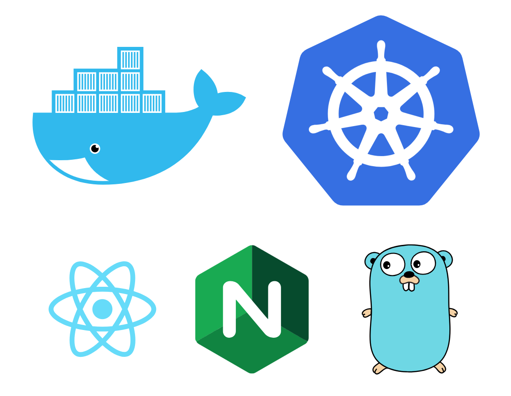

# docker-experiments

[](https://circleci.com/gh/topheman/docker-experiments)

<p align="center"></p>

This started as a simple use case to discover `docker` and `docker-compose` 🐳 :

* A [front](front) made with create-react-app, running in a nodejs container for development
* A very simple [api](api) made in go (the challenge is also not to have everything in JavaScript)

I also setup **deployments on a local kubernetes** ☸️ and tests are running on [CircleCI](https://circleci.com/gh/topheman/docker-experiments) on each push.

## TL;DR

You are a true developer? You don't RTFM? After all, this is why we have docker ... not to bother with all the boring setup/install steps ... 😉

```shell
git clone https://github.com/topheman/docker-experiments.git
cd docker-experiments
docker-compose up -d
```

You are good to go with a development server running at [http://localhost:3000](http://localhost:3000), with the front in react, the api in go and everything hot reloading. 👏

Try to take a few minutes to read the doc bellow ... 😇

## Summary

* [Prerequisites](#prerequisites)
* [Setup](#setup)
* [Development 🛠](#development)
* [Tests 🌡](#tests)
* [Production - docker-compose 🐳](#production---docker-compose)
* [Deployment - kubernetes ☸️](#deployment---kubernetes)
* [Notes 📋](#notes)
  * [Docker Multi-stage builds](#docker-multi-stage-builds)
  * [Docker networks / Kubernetes services](#docker-networks--kubernetes-services)
  * [Restart on failure](#restart-on-failure)
  * [Commands](#commands)
    * [Docker commands](#docker-commands)
    * [Kubernetes commands](#kubernetes-commands)
* [FAQ](#faq)
  * [CircleCI](#circleci)
    * [How to use latest version of docker-compose / docker-engine](#how-to-use-latest-version-of-docker-compose--docker-engine)
    * [Docker vs Machine executors](#docker-vs-machine-executors)
  * [Why does /api fallbacks to index.html in production](#why-does-api-fallbacks-to-indexhtml-in-production)
* [What's next?](#whats-next)
* [Resources](#resources)
* [Author](#author)

## Prerequisites

You need to have installed:

* docker / docker-compose
* npm / node (optional)
* local kubernetes server and client (only if you want to play with kubernetes deployment - more about that on the [deployment section](#deployment---kubernetes))

## Setup

```shell
git clone https://github.com/topheman/docker-experiments.git
```

A [Makefile](Makefile) is available that automates all the commands that are described bellow. For each section, you'll find the related commands next to the 🖊 emoji.

Just run `make help` to see the whole list.

## Development

### Launch development

```shell
docker-compose up -d
```

This will create (if not already done) and launch a whole development stack, based on [docker-compose.yml](docker-compose.yml), [docker-compose.override.yml](docker-compose.override.yml), [api/Dockerfile](api/Dockerfile) and [front/Dockerfile](front/Dockerfile) - following images:

* `topheman/docker-experiments_front_development`: for react development (based on nodejs image)
* `topheman/docker-experiments_api_development`: for golang in development mode (using [fresh](https://github.com/pilu/fresh) to build and restart the go webserver when you change the sources)
  * The `services.api.command` entry in [docker-compose.override.yml](docker-compose.override.yml) will override the default `RUN` command and start a dev server (instead of running the binary compiled in the container at build time)

Go to http://localhost:3000/ to access the frontend, you're good to go, the api is accessible at http://localhost:5000/.

🖊 `make dev-start`, `make dev-start-d`, `make dev-stop`, `make dev-ps`, `make dev-logs`, `make dev-logs-front`, `make dev-logs-api`

## Tests

### Launch tests

```shell
docker-compose run --rm -e CI=true front npm run -s test && docker-compose run --rm api go test -run ''
```

🖊 `make test`, `make test-front`, `make test-api`

## Production - docker-compose

This section is about **testing the production images with docker-compose** 🐳 (check the [deployment section](#deployment---kubernetes) to deploy with kubernetes locally).

Make sure you have built the frontend with `docker-compose run --rm front npm run build`, then:

```shell
docker-compose -f ./docker-compose.yml -f ./docker-compose.prod.yml up --build
```

Note: make sure to use the `--build` flag so that it will rebuild the images if anything changed (in the source code or whatever), thanks to [docker images layers](https://docs.docker.com/develop/develop-images/dockerfile_best-practices/), only changes will be rebuilt, based on cache (not the whole image).

This will create (if not already done) and launch a whole production stack:

* No nodejs image (it should not be shipped to production, the development image is only used to launch the container that creates the build artefacts with create-react-app).
* `topheman/docker-experiments_api_production`: for the golang server (with the app compiled) - containing only the binary of the golang app (that way the image)
* `topheman/docker-experiments_nginx`: which will:
  * serve the frontend (copied from `/front/build`)
  * proxy `/api` requests to `http://api:5000` (the docker subnet exposed by the golang api container)

Access [http://localhost](http://localhost) and you're good to go.

🖊 `make prod-start`, `make prod-start-d`, `make prod-start-no-rebuild`, `make prod-start-d-no-rebuild`, `make prod-stop`, `make prod-ps`, `make prod-logs`, `make prod-logs-front`, `make prod-logs-api`

## Deployment - kubernetes

This section is about **deploying the app locally with kubernetes** ☸️ (not tested with a cloud provider). To stay simple, there aren't any TLS termination management (only port 80 exposed).

Local kubernetes server and client:

* If you have the latest docker for Mac, both are [shipping with kubernetes](https://blog.docker.com/2018/01/docker-mac-kubernetes/)
* Otherwise, you can use [minikube](https://github.com/kubernetes/minikube) for the server and install [`kubectl`](https://kubernetes.io/docs/tasks/tools/install-kubectl/) (kubernetes client)

The files descripting the deployments are stored in the [deployments](deployments) folder. You will find two files, each containing the deployment and the service.

### Deploy with kubernetes

1) If you haven't built the frontend, run `docker-compose run --rm front npm run build`

2) Build the production images:

```shell
docker build ./api -t topheman/docker-experiments_api_production:0.1.0
docker build . -f Dockerfile.prod -t topheman/docker-experiments_nginx:0.1.0
```

Note: They are tagged `0.1.0`, same version number as in the deployments files (want to put an other version number ? Don't forget to update the deployment files). For the moment, I'm not using [Helm](http://helm.readthedocs.io/en/latest/generate-and-template/) that let's you do string interpolation on yml files.

3) Create your pods and services

Make sure nothing is up on port `80`, then:

```shell
kubectl create -f ./deployments/api.yml -f ./deployments/front.yml
```

You're good to go, check out [http://localhost](http://localhost)

To stop and delete the pods/services you created:

```shell
kubectl delete -f ./deployments/api.yml -f ./deployments/front.yml
```

They won't stop right away, you can list them and see their status with:

```shell
kubectl get pods,services
```

[More commands](#kubernetes-commands)

🖊 `make kube-start`, `make kube-start-no-rebuild`, `make kube-stop`, `make kube-ps`

## Notes

### Docker Multi-stage builds

Thanks to [docker multi-stage builds](https://docs.docker.com/develop/develop-images/multistage-build/), the golang application is built in a docker golang:alpine image (which contains all the tooling for golang such as compiler/libs ...) and produces a small image with only a binary in an alpine image (small Linux distrib).

The targets for multi-stage build are specified in the `docker*.yml` config files.

The [api/Dockerfile](api/Dockerfile) will create such a production image by default.

You can tell the difference of weight:

```
docker images
topheman/docker-experiments_api_production      latest  01f1b575fae6  About a minute ago  11.5MB
topheman/docker-experiments_api_development     latest  fff1ef3ec29e  8 minutes ago       426MB
topheman/docker-experiments_front_development   latest  4ed3aea602ef  22 hours ago        225MB
```

### Docker networks / Kubernetes services

In development, the api server in golang is available at [http://localhost:5000](http://localhost:5000) and proxied onto [http://localhost:3000/api](http://localhost:3000/api) (the same port as the front, thanks to create-react-app [proxy](front/README.md#proxy)).

In **production** mode, we only want the golang server to be available via `/api` (we don't want to expose it on it's own port).

To make it work:

* the docker-compose golang api service is named `api` - [see docker-compose.yml](docker-compose.yml).
* the kubernetes services exposing the api is also named `api` - [see deployments/api.yml](deployments/api.yml)

That way, the nginx conf can work with both docker-compose AND kubernetes, proxying `http://api` - [see nginx/site.conf](nginx/site.conf).

### Restart on failure

If your app exits with a failure code (greater than 0) inside the container, you'll want it to restart (like you would do with pm2 and node apps).

With [docker-compose/production](#production---docker-compose), the, directive `restart: on-failure` in the [docker-compose.yml](docker-compose.yml) file will ensure that. You'll be able to check it by clicking on the "exit 1 the api server" button, which will exit the golang api. You'll see that the uptime is back counting from 0 seconds.

With [kubernetes/deployment](#deployment---kubernetes), I setup 2 replicas of the api server, so when you retrieve the infos, the hostname might change according of the api pod you're balance on.

Exiting one pod won't break the app, it will fallback on the remaining replica. If you exit the two pods, you'll get an error retrieving infos, until one of the pod is back up by kubernetes (check their status with `kubectl get pods`).

### Commands

#### Docker commands

* `docker-compose run --rm front npm run test`: launch a front container in *development* mode and run tests
* `docker-compose -f ./docker-compose.yml run --rm api <cmd>`: launch an api container in *production* mode and run `<cmd>`
* `docker-compose down`: stop and remove containers, networks, volumes, and images created by `docker-compose up`

Don't want to use `docker-compose` (everything bellow is already specified in the `docker*.yml` files - only dropping to remember the syntax for the futur) ?

* `docker build ./api -t topheman/docker-experiments_api_production`: build the `api` and tag it as `topheman/docker-experiments_api_production` based on [api/Dockerfile](api/Dockerfile)
* `docker run -d -p 5000:5000 topheman/docker-experiments_api_production`: runs the `topheman/docker-experiments_api_production` image previously created in daemon mode and exposes the ports
* `docker build ./front -t topheman/docker-experiments_front_development`: build the `front` and tag it as `topheman/docker-experiments_front_development` based on [front/Dockerfile](front/Dockerfile)
* `docker run --rm -p 3000:3000 -v $(pwd)/front:/usr/front -v front-deps:/usr/front/node_modules topheman/docker-experiments_front_development`:
  * runs the `topheman/docker-experiments_front_development` image previously created in attach mode
  * exposes the port 3000
  * creates (if not exists) and bind the volumes
  * the container will be removed once you kill the process (`--rm`)
* `docker rmi $(docker images -q --filter="dangling=true")`: remove dangling images (layers that have no more relationships to any tagged image. Tagged as <none>, they no longer serve a purpose and consume disk space)

#### Kubernetes commands

[kubectl Cheat Sheet](https://kubernetes.io/docs/reference/kubectl/cheatsheet/)

* `kubectl create -f ./deployments/api.yml -f ./deployments/front.yml`: creates the resources specified in the declaration files
* `kubectl delete -f ./deployments/api.yml -f ./deployments/front.yml`: deletes resources specified in the declaration files
* `kubectl scale --replicas=3 deployment/docker-experiments-api-deployment`: scales up the api through 3 pods

## FAQ

### CircleCI

#### How to use latest version of docker-compose / docker-engine

I had the following error on my [first build](https://circleci.com/gh/topheman/docker-experiments/2):

> ERROR: Version in "./docker-compose.yml" is unsupported. You might be seeing this error because you're using the wrong Compose file version. Either specify a supported version ("2.0", "2.1", "3.0", "3.1", "3.2") and place your service definitions under the `services` key, or omit the `version` key and place your service definitions at the root of the file to use version 1.
>
> For more on the Compose file format versions, see https://docs.docker.com/compose/compose-file/

The reason was because I'm using **docker-compose file format v3.4**, which doesn't seem to be supported by the version of docker-engine used on the default setup of CircleCI - [see compatibility matrix](https://docs.docker.com/compose/compose-file/#compose-and-docker-compatibility-matrix).

With CircleCI, in **machine executor mode**, you can change/customize the image your VM will be running (by default: `circleci/classic:latest`) - see the [list of images available](https://circleci.com/docs/2.0/configuration-reference/#machine). I simply changed the image to use:

```diff
version: 2
jobs:
  build:
-    machine: true
+    machine:
+      image: circleci/classic:201808-01
```

Checkout [.circleci/config.yml](.circleci/config.yml)

Note: Why use docker-compose file format v3.4 ? To take advantage of the `target` attribute.

#### Docker vs Machine executors

> You can not build Docker within Docker.

To build/push docker images, you have two solutions on CircleCI:

* Use the [machine executor mode](https://circleci.com/docs/2.0/executor-types/#using-machine): your jobs will be run in a dedicated, ephemeral Virtual Machine (VM) - so, you can directly run docker inside
* Use the [setup_remote_docker](https://circleci.com/docs/2.0/building-docker-images/#overview) key: a remote environment will be created, and your current primary container will be configured to use it. Then, any docker-related commands you use will be safely executed in this new environment

### Why does /api fallbacks to index.html in production

#### Service Worker

create-react-app ships with a service worker by default which implementation is based on [sw-precache-webpack-plugin](https://github.com/goldhand/sw-precache-webpack-plugin) (a Webpack plugin that generates a service worker using [sw-precache](https://github.com/GoogleChromeLabs/sw-precache) that will cache webpack's bundles' emitted assets).

It means that a `service-worker.js` file will be created at build time, listing your public static assets that the service worker will cache using a [cache first](https://developers.google.com/web/fundamentals/instant-and-offline/offline-cookbook/#cache-falling-back-to-network) strategy (on a request for an asset, will first hit the service worker cache and serve it, then call the network and update the cache - this makes the app fast and offline-first).

From the [create-react-app doc](front/README.cra.md#serving-apps-with-client-side-routing):

> On a production build, and in a browser that supports [service workers](https://developers.google.com/web/fundamentals/getting-started/primers/service-workers),
the service worker will automatically handle all navigation requests, like for
`/todos/42` or `/api`, by serving the cached copy of your `index.html`. This
service worker navigation routing can be configured or disabled by
[`ejecting`](front/README.cra.md#npm-run-eject) and then modifying the
[`navigateFallback`](https://github.com/GoogleChrome/sw-precache#navigatefallback-string)
and [`navigateFallbackWhitelist`](https://github.com/GoogleChrome/sw-precache#navigatefallbackwhitelist-arrayregexp)
options of the `SWPreachePlugin` [configuration](https://github.com/facebook/create-react-app/blob/master/packages/react-scripts/config/webpack.config.prod.js).

## What's next?

The next thing that will be comming are:

* [x] setup CI
* [x] using [nginx](https://www.nginx.com/) as a reverse-proxy to:
  * [x] serve the golang api which is in its own container on `/api`
  * [x] make a build of the front and serve it at the root
* [x] use [kubernetes](https://kubernetes.io/) to automate deployment
  * [x] start by playing in local with [minikube](https://github.com/kubernetes/minikube)
  * [ ] add [Helm](http://helm.readthedocs.io/en/latest/generate-and-template/) to do string interpolation in yaml description files ?
* [ ] linting / formatting + pre-commit hooks
  * [ ] add linting / formatting support (eslint/prettier) with advanced config for the JavaScript part
  * [ ] back it up with pre-commit hooks (husky ?)
  * The challenge being:
    * any npm dependency is currently installed on a volume mounted inside the front container (not accessible by host)
    * how to elegantly have lint/formatting task also running on host (for vscode plugins for example but also npm tasks like), without relying on global modules (this would be cheating 😉 + we should not assume anything about the computer our project is cloned on)
    * how to elegantly share pre-commit hooks ? (using husky would mean an `npm install` at the root of the project)

*This is still in progress*.

## Resources

* Docker
  * 📺 💯 [Better understand containers by coding one from scratch by Liz Rice](https://twitter.com/topheman/status/1014936620309647361)
  * 📺 [Create a Development Environment with Docker Compose by Mark Ranallo](https://www.youtube.com/watch?v=Soh2k8lCXCA)
  * 📺 [Rapid Development With Docker Compose](https://www.youtube.com/watch?v=o6SScget37w)
  * [Golang and Docker for development and production](https://medium.com/statuscode/golang-docker-for-development-and-production-ce3ad4e69673) - use [pilu/fresh](https://github.com/pilu/fresh) to rebuild on changes in development
  * [Create the smallest and secured golang docker image based on scratch](https://medium.com/@chemidy/create-the-smallest-and-secured-golang-docker-image-based-on-scratch-4752223b7324)
    * [docker-compose with multi-stage build target (official doc)](https://docs.docker.com/compose/compose-file/#target)
* Kubernetes
  * 📺 [Learn Kubernetes by CoderJourney](https://www.youtube.com/playlist?list=PLbG4OyfwIxjFE5Ban_n2JdGad4EDWmisR)
    * [Source code](https://github.com/coderjourney/meal_plan)
  * 📺 [Run Kubernetes Locally Using Minikube by CoderJourney](https://coderjourney.com/run-kubernetes-locally-using-minikube/)
  * [Setup bash completion for `kubectl`](https://twitter.com/topheman/status/1022939077602156546)

More bookmarks from my research:

* Docker
  * [Generic Docker Makefile](https://github.com/mvanholsteijn/docker-makefile)
  * [Awesome-docker - A curated list of Docker resources and projects](https://awesome-docker.netlify.com/)
* Kubernetes
  * [Kubernetes & Traefik 101— When Simplicity Matters](https://dev.to/geraldcroes/kubernetes--traefik-101-when-simplicity-matters-6k6)
  * [Tutorial : Getting Started with Kubernetes with Docker on Mac](https://rominirani.com/tutorial-getting-started-with-kubernetes-with-docker-on-mac-7f58467203fd)
  * [kubernetes/dashboard](https://github.com/kubernetes/dashboard)
  * [Kubernetes Ingress](https://medium.com/@cashisclay/kubernetes-ingress-82aa960f658e)
    * [Setting up Nginx Ingress on Kubernetes](https://hackernoon.com/setting-up-nginx-ingress-on-kubernetes-2b733d8d2f45)
    * [Advanced kubernetes ingress](https://koudingspawn.de/advanced-ingress/)
    * [Kubernetes NodePort vs LoadBalancer vs Ingress? When should I use what?](https://medium.com/google-cloud/kubernetes-nodeport-vs-loadbalancer-vs-ingress-when-should-i-use-what-922f010849e0)
  * [Kubectl apply vs kubectl create?](https://stackoverflow.com/questions/47369351/kubectl-apply-vs-kubectl-create)
  * [awesome-kubernetes - A curated list for awesome kubernetes sources](https://ramitsurana.github.io/awesome-kubernetes/)
* [Tutoriel Linux : Makefile](https://youtu.be/2VV9FAQWHdw)

## Author

[Christophe Rosset](https://github.com/topheman)